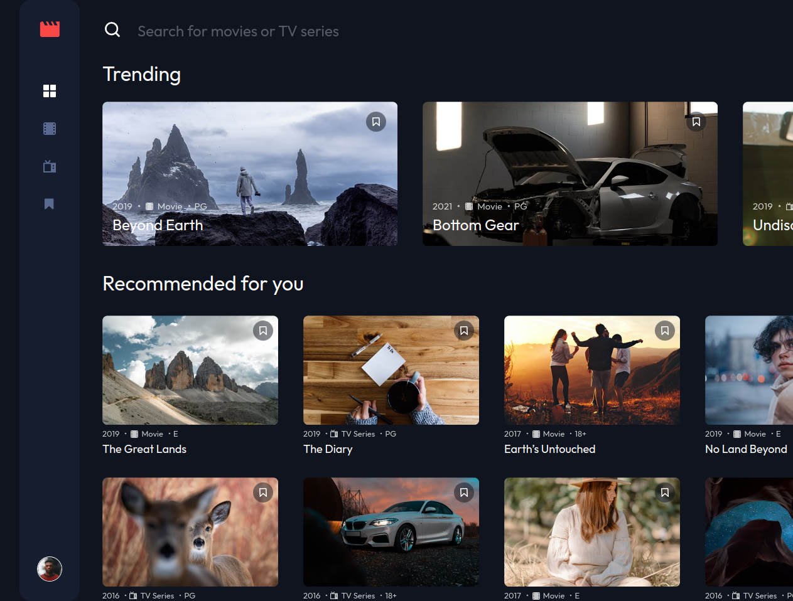

# Frontend Mentor - Entertainment web app solution

This is a solution to the [Entertainment web app challenge on Frontend Mentor](https://www.frontendmentor.io/challenges/entertainment-web-app-J-UhgAW1X). Frontend Mentor challenges help you improve your coding skills by building realistic project.

## Table of contents

- [Overview](#overview)
  - [The challenge](#the-challenge)
  - [Screenshot](#screenshot)
  - [Links](#links)
  - [Built with](#built-with)
  - [Continued development](#continued-development)
  - [Useful resources](#useful-resources)
- [Author](#author)

## Overview

### The challenge

Users should be able to:

- View the optimal layout for the app depending on their device's screen size
- See hover states for all interactive elements on the page
- Navigate between Home, Movies, TV Series, and Bookmarked Shows pages
- Add/Remove bookmarks from all movies and TV series
- Search for relevant shows on all pages

### Screenshot

### Links

- Solution URL: [Solution](https://www.frontendmentor.io/solutions/entertainment-web-app-1BoHEowRLq)
- Live Site URL: [Live site](https://media-web-app.netlify.app/)

### Built with

- React.js
- Tailwindcss
- Flexbox
- CSS Grid
- [React](https://reactjs.org/) - JS library
- [Tailwindcss](https://tailwindcss.com/) - A utility-first CSS framework

## Author

- Website - [Ammar's Portfolio](https://ammarcode.github.io/Portfolio/)
- Frontend Mentor - [@AmmarCode](https://www.frontendmentor.io/profile/AmmarCode)
